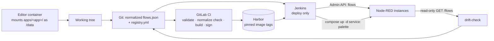

# Architecture — Node-RED multi-instance deployment

Status: target architecture, not yet built. Rationale and closed decisions: [`decisions.md`](decisions.md). Unresolved gaps and the commands that close them: [`open-questions.md`](open-questions.md).

## The problem

16 Node-RED runtimes across 10 servers. Flows are edited in the browser editor and today reach production by hand. There is no history, no review, and no way to tell what is running.

Measured, not assumed — `scripts/collect-inventory.py` visited every host:

| | |
|---|---|
| 6 servers with a dev/prod pair | `cho`, `gor`, `jan`, `slu`, `srem`, `wag` — 12 instances |
| 1 server cut over | `wfm-svr-lin01` now runs `wfm-prod` out of `node-red-prod` (`adminAuth` on, `/node-red-prod`) beside the workbench `node-red-test`, like the other nine. The old `node-red` is stopped and still in the compose file until it is retired (`go-live-plan.md`, phase 1) |
| 2 servers under FlowFuse | `pod-svr-lin01`, `dpn-svr-iot` — migration targets, see below |
| 1 server with no Node-RED at all | `foi-svr-lnx01` — NATS, iot-bridges, dashboards |

Two of those servers, `wfm-svr-lin01` and `dpn-svr-iot`, are absent from the Jenkins host map, which knows 8. The map is the input to the new pipeline, so it grows by two.

Topology is **not a fleet**: no two instances share a flow signature — the collector compared the node type and name multiset of every flow, ignoring ids and layout, and found no match. Every instance is its own application. `wag-svr-lin01` makes the point concretely: `node-red-prod` has 15 nodes and no palette, `node-red-test` has 222 nodes and two palette modules. A template-first system would be wrong, and there are no shared `apps/` directories to factor out.

The palette across the estate is wider than the first pair suggested: `node-red-contrib-opcua`, `node-red-contrib-postgresql`, `node-red-contrib-mssql-plus`, `node-red-contrib-queue-gate`, `node-red-dashboard`, `node-red-node-ui-table`, `node-red-contrib-ui-upload`, `@martip/node-red-xlsx`. Largest instance is `srem-svr-lin01/node-red-prod` at 205 nodes across 40 node types.

## The shape

Git is the source of truth. Two deployment transports, both versioned, neither silent:

| What changes | Transport | Frequency | Container restart |
|---|---|---|---|
| Flow logic | Node-RED Admin API `POST <admin_root>/flows` | daily | no |
| Palette modules (npm) | image rebuild + `docker compose up -d <compose_service>` | rare | yes |

Splitting them is the point. Flow deploys are frequent, so they must not interrupt MQTT ingest. Palette deploys are rare, so a restart gap is acceptable there.

Three levels of interruption, and it is worth knowing which one a change costs:

| | What actually stops | Container |
|---|---|---|
| Flow deploy (`DEPLOY_PALETTE=false`) | Only the tabs whose content changed. `deploy.py` sends `Node-RED-Deployment-Type: flows`, so an untouched tab keeps running, keeps its connections and keeps its context | untouched — same process, same uptime, same address |
| Palette deploy (`DEPLOY_PALETTE=true`, `DRY_RUN=false`) | Everything. `docker compose up -d <service>` replaces the container | **recreated** — new container, new address, `/data` survives because it is a bind mount |
| `settings.js` edit | Everything, same as above | recreated, and by hand: the pipeline never edits `settings.js` |

`DEPLOY_PALETTE=true` with `DRY_RUN=true` does nothing at all — the Jenkinsfile guards the pull and the recreate on `!DRY_RUN`, so a dry run cannot restart anything.



## Repository layout

```
apps/<app-name>/
  flows.json      normalized, editor-valid, no placeholders
  package.json    palette dependencies for this app
  Dockerfile      FROM base, COPY package.json, npm install
base/Dockerfile   pinned nodered/node-red:<version> — see Version spread
compose/          per-instance compose fragments
registry.yml      instance inventory — see registry.md
schemas/          JSON Schema for registry.yml
compose/editor.yml  a local editor that writes into the working tree
scripts/
  normalize.py    canonicalize flows.json
  deploy.py       token → GET /flows → rev → POST /flows
  capture.py      the return path: running flow → apps/<app>/flows.json
  drift-check.py  read-only: running flows vs. Git
docs/             this directory
INVENTORY.md      inventory output, secrets stripped
```

One app, one instance — no two instances share a flow. A flow file in the repo always opens in the editor unchanged, which is what keeps the return path from editor to Git alive.

## Flow deploy sequence

`deploy.py` runs **on the target host**, not on the Jenkins agent. Jenkins ships it over the existing SSH hop and executes it there; from the host it reaches the instance by container IP, which the collector confirmed answers `401` on all 13.

Running on the host is what makes one code path work everywhere. Port publishing is inconsistent — `cho`, `gor`, `jan` and `wfm` publish 1880/1881, `slu-test` 1882, while `wag`, `srem` and `slu-prod` publish nothing — and the site servers sit in separate subnets, so a central agent would reach some instances and not others.

SSH is a transport for the script, never a path for writing flow files. The `rev` handshake and the no-restart property are exactly what the Admin API is here for.

`scripts/deploy.py`, one instance at a time:

1. `POST <admin_root>/auth/token` → Bearer token. `adminAuth` is active on 12 of 14, so nearly every call needs one. `wfm-prod` has it switched off and answers `200` unauthenticated — `deploy.py` skips the token call where `auth_credential_id` has nothing behind it, and that is a gap to close, not a feature.
2. `GET <admin_root>/flows` → capture `rev`.
3. `POST <admin_root>/flows` with header `Node-RED-Deployment-Type: flows` and the captured `rev`.
4. `409` → abort. The running flow diverged from Git; that must surface as a red pipeline, never be flattened.

Step 2 and step 3 happen seconds apart in the same run, so the rev from step 2 already contains any browser edit made before it — the POST would succeed and flatten that edit. The abort in step 4 is therefore only reachable when the rev posted is the one a **human reviewed**: `deploy.py --expect-rev <rev>`, filled from the dry run's output (Jenkins parameter `EXPECT_REV`). Without it a deploy overwrites whatever it finds, and says so on stderr. One rev belongs to one instance, so it cannot be combined with `--all`.

There is no render step between the `GET` and the `POST`: no app is shared, so no flow has to vary per instance (decision 14). The committed flow is what gets posted.

`--dry-run` prints the normalized diff and exits 0. `--instance <name>` targets one instance, `--all` every instance with an app. Standard library only — the site hosts are not guaranteed to have pip.

`registry.yml` is YAML and PyYAML may be absent on a host, so CI emits `registry.json` and Jenkins ships it alongside the script. Hand-parsing YAML on the host was the alternative, and a parser wrong in one edge case deploys the wrong flow to the wrong instance.

`admin_root` is per-instance and was probed against the container rather than parsed: 8 instances answer on `/node-red-prod` or `/node-red-test`, and `gor-prod`, `gor-test`, `jan-prod`, `jan-test` and `wfm-prod` have no admin root at all and answer on plain `/flows`. In `registry.yml` those carry `admin_root: ""`. `wfm-test` did not exist when this was probed; its `settings.js` carries `httpAdminRoot: '/node-red-test'`, so it is the fourteenth and serves under a path of its own.

Probing against the container is not a detail: on `wfm-svr-lin01` nginx serves `wfm-prod` as `http://wfm-svr-lin01/node-red-prod` and strips that prefix, so the browser URL and the runtime's own root disagree. The deploy runs on the host and calls the container, so `admin_root` follows the runtime.

Parsing `settings.js` for this field is a trap: Node-RED ships every option present but commented out, so a naive read reports the template's `/admin` default as configured. All five of those instances did, and all five returned `404`.

## CI split

Two systems, already wired in this repo, with different reach:

**GitLab CI** (`.gitlab-ci.yml`) — everything that needs no site access:
- registry.yml schema validation
- normalize check: fail if any committed `flows.json` differs from its normalized form
- external-module check: fail if any function node declares `"module":` (see below)
- image build via the `ci-cd-catalog/buildah` component, signed via `ci-cd-catalog/cosign`
- existing scan components (semgrep, trivy, hadolint) apply to the new Dockerfiles unchanged

**Jenkins** (`Jenkinsfile`) — deploy only, because it holds the per-host SSH credentials (`<host>_pw`) and the host map, and because it is the only agent with network reach into the sites. Runs are serialized (`disableConcurrentBuilds()`): two at once would read the same `rev` and the second would abort on a `409` that no browser edit caused.

It reads `registry.yml` rather than repeating it, writes `registry.json`, ships that plus `deploy.py`, `normalize.py` and the one app's `flows.json` to the target host, and runs the deploy there. The Admin API password travels in a `600` env file that is sourced and deleted in the same shell — passing it as an argument would put it in `ps` for anyone on the host. `DRY_RUN` defaults to **on**.

The host map now holds all 10 servers: `wfm-svr-lin01` and `dpn-svr-iot` were missing from the inherited one.

Compose calls are **service-scoped** — `docker compose up -d <compose_service>`, which is why `compose_service` is a registry field. The service name is not the instance name: six hosts each run one called `node-red-prod`.

The compose file differs per host (`code/node-red/`, `energy/`, `Base_Container/`, `base_container/`), and the neighbour probe found no non-Node-RED service in any of those projects. That contradicts the earlier report that NATS shares `wag`'s file, so treat it as unconfirmed rather than settled — one `docker compose -f <file> config --services` per host closes it. Service-scoped calls cost nothing and hold either way.

## Measured environment facts

`scripts/collect-inventory.py` visited all 10 hosts. These are measured, not assumed.

`wag-svr-lin01` was rebuilt shortly before the inventory, which explains both its 5.0.1 runtime and its `node-red-prod` holding only 15 nodes while `node-red-test` holds 222 — that reads more like a prod instance not yet migrated back after the rebuild than like a small production application.

| Fact | Value | Consequence |
|---|---|---|
| Node-RED versions | **4.0.5, 4.0.9, 5.0.1** | only `wag` runs 5.0.1; 12 of 14 are on 4.x. Pinning is not one tag — see "Version spread" below |
| Image tag in use | `nodered/node-red:latest` | must be pinned; `latest` + `restart: always` drifts silently per host |
| `credentialSecret` | commented out | generated key exists only in `/data/.config.runtime.json`; single copy, in no backup |
| `flows_cred.json` | present on both | real credentials in use; undecryptable without that key file |
| `httpAdminRoot` | 8 instances on `/node-red-prod` or `/node-red-test`, 5 on `/` | probed, not parsed; API base path is per-instance and 5 instances have none |
| `adminAuth` | active on 12, **off on `wfm-prod`**, not yet set on the new `wfm-test` | token call required before every API call — except `wfm-prod`, which answers 200 and has nothing to authenticate against |
| published ports | **mixed** | `cho`, `gor`, `jan` publish 1880/1881, `slu-test` 1882, `wfm-prod` 1880 and `wfm-test` 1881; `wag`, `srem` and `slu-prod` publish nothing. Not a uniform property, so the deploy path cannot rely on one |
| `flowFilePretty` | `true` | flows already multi-line; the normalizer strips and sorts, it does not reformat |
| `contextStorage` | commented out | memory-only context, so a recreate has nothing to restore — and nothing to carry across either: whatever a flow accumulated in `flow.` or `global.` context is gone. A flow deploy only resets the context of the tabs it changed |
| `functionExternalModules` | `true`, zero nodes using it | image baking is a real guarantee only while that stays zero — hence the CI check |
| compose location | shared `base_container/docker-compose.yml` | service-scoped compose calls until the split lands |
| container engine | **podman** on a workstation, **Docker** on the servers | `nr.py edit` detects it; `CONTAINER_ENGINE` overrides. On Windows `podman compose` delegates to `docker-compose.exe` but points it at podman's socket, so a registry login belongs to podman |

## Image tags

Images live in the Harbor project `dap-node-red`, beside the existing `dap-api` and `dap-ui`. One repository per app:

```
harbor.aks-infra.polipol-service.de/dap-node-red/<app>:<node-red-version>-<palette build>
```

`wag-prod:5.0.1-1` reads as "the flow for wag-prod, on Node-RED 5.0.1, first palette build". The version half is the version that instance already runs, so pinning changes nothing but the drift; the suffix increments when `apps/<app>/package.json` changes. Both halves are visible to a human reading `registry.yml`, which a commit SHA would not be.

## Version spread

The estate runs three Node-RED versions, because every instance pulls `nodered/node-red:latest` and each was first started on a different date:

| Version | Instances |
|---|---|
| 4.0.5 | `cho-prod`, `cho-test`, `gor-prod`, `gor-test` |
| 4.0.9 | `jan-prod`, `jan-test`, `slu-prod`, `slu-test`, `srem-prod`, `srem-test`, `wfm-prod`, `wfm-test` |
| 5.0.1 | `wag-prod`, `wag-test` |

Pinning (decision 5) is therefore not one tag for everything. Pin each instance to **the version it is already running**, so the pin changes nothing except the drift. Converging on one version is an upgrade — 12 instances crossing a major boundary — and it belongs in its own change, after the pipeline exists and can roll one instance at a time.

That also explains group 3 in the settings.js comparison: `wag`'s file carries `telemetry` and `globalFunctionTimeout` blocks because 5.0.1 generated it, not because anyone edited it.

## Empty instances

`slu-prod` and `slu-test` hold no flow at all — no `flows.json`, no `flows_cred.json`, `/data` untouched since July 2025. They are **running**, with `adminAuth` on and answering `401`; they are not stopped, they are empty. Starting them changes nothing, because there is nothing in them to start.

They carry `app: null` in `registry.yml` and get no `apps/` directory until someone decides what they are for. When that happens they are the safest first true deploy in the estate: an empty instance has nothing to lose.

That makes **12 instances with a flow of their own**, not 14 — the twelfth being `wfm-test`, whose flow is new rather than captured.

## Normalization

`normalize.py` reorders and reformats. It drops nothing.

- tabs and subflows keep their existing relative order — the array order of `tab` nodes *is* the tab order in the editor, and no other field carries it
- every other node follows the tab it belongs to, sorted by `id` within that tab
- one key order per node: `id`, `type`, `z`, `g`, `name`… then the rest alphabetically, `wires` last
- 2-space indent, trailing newline, non-ASCII left readable

Idempotent, and order-independent for everything Node-RED may reshuffle on a deploy. That reshuffling is the noise worth removing: an unnormalized `flows.json` diffs against itself after a deploy that changed nothing.

**No key is stripped, and one earlier instruction would have corrupted every flow.** An earlier spec called for dropping `x`, `y` and `z` as "positional keys". `x` and `y` are canvas coordinates; **`z` is the id of the tab or subflow the node belongs to.** Dropping it detaches every node from its tab. `w`/`h` size a group node and `g` is group membership — structure as well.

`x` and `y` stay too, for a different reason: decision 6 requires a committed flow to open in the editor unchanged, and a 205-node flow whose nodes all sit at the origin does not. A node move costs two changed lines, which is cheap next to losing the editor→Git return path.

Test it against all 11 real flows in `samples/`, hardest against `srem-prod` — 205 nodes, 40 node types, 134 KB. If a flow that size does not diff readably for a human reviewer, the whole Git-as-source-of-truth approach fails at this step, and that is cheap to discover in an hour.

## FlowFuse instances

Two servers run their Node-RED under FlowFuse. They are a **migration source**, not a deployment target: FlowFuse gets no transport, no `registry.yml` entry and no pipeline stage. Each instance is exported once, lands in `apps/` as a normalized `flows.json`, comes up as a plain container, and from then on is an instance like any other.

That direction is the same decision the whole architecture rests on. FlowFuse is a control plane that owns the flows, which is the category decision 1 rejected — the reasoning does not change because the control plane is a good one.

Both run `flowfuse/device-agent:latest`. The flow is a file, not a platform export — but it lives **inside the container**, not on the host: the agent's compose mounts only `./device.yml`, so `/opt/flowfuse-device/project/` is the container's own write layer. Extraction is `docker cp` from a running agent, which is why the agent is retired last.

Measured on both hosts, 2026-09-11:

| | `pod-svr-lin01` | `dpn-svr-iot` |
|---|---|---|
| nodes / node types | 154 / 25 | 852 / 41 |
| tabs | Zund Europol, Druckluft | beil, huh, zund, Bäumer, DBT, homag, Email, Koch, EPC, MDE_Collection, PoliMowa |
| `flows.json` | 70 KB | 428 KB |
| Node-RED | 4.0.8, pinned | `latest`, resolved to 4.0.9 |
| `flows_cred.json` | 5980 B | 9664 B |
| agent up since | 7 weeks | 6 months |

**The credential key is carryable** (open question 1, closed). It is `credentialSecret` in `device.yml`, the one file the compose bind-mounts, and `.config.runtime.json` holds no `_credentialSecret` of its own on either host — so the file on disk is encrypted with the key from the config, and the migration is "copy two files", not "re-enter every credential". The new instance must name that key in **both** places, as in "Moving an instance to a new container".

Two things the numbers above do not settle:

- **FlowFuse's own palette nodes.** Both projects depend on `@flowfuse/nr-project-nodes` and `@flowfuse/nr-assistant`, `dpn-svr-iot` also on `@flowfuse/node-red-dashboard`. The assistant is an editor helper and drops out. Project-link nodes route through FlowFuse's broker: wherever the flow uses one, that path **stops working** off the platform and has to be replaced — with NATS or MQTT, which both hosts already run. The dashboard is open source and survives, baked into the image like any other module.
- **The device agent keeps syncing.** The file in the container is the agent's copy of what the platform holds; the platform stays the source of truth until the device is unenrolled. So the cutover order matters: copy the flow, stand up the plain container, unenroll, then retire the agent — otherwise the agent overwrites its copy from the platform. `image: latest` with nothing but `device.yml` mounted makes that sharper: after the unenroll, one `docker compose pull` would leave nothing to recover from.

Palette is FlowFuse-managed: whatever it installs per project becomes that app's `apps/<app>/package.json`, which the image then bakes — minus the FlowFuse-only modules.

Sequencing: migrate a plain-container pair first. It proves normalize → commit → deploy end to end against the simpler case, and the FlowFuse cutover then only adds the export step to a path that already works.

## The two directions

Git to instance is `deploy.py`. Instance to Git is `capture.py`. Both share one transport and one normalizer, so what one writes the other reads back unchanged — the inventory proved that against `wag-prod` and `gor-prod`.

The return direction is what keeps this from decaying. A pipeline that only pushes makes a browser edit into a problem, and people learn to stop using the browser. With `capture.py` a browser edit is a commit, and the editor stays a legitimate tool.

`compose/editor.yml` closes the loop locally: a Node-RED container mounting `apps/<app>/` as `/data`, so pressing Deploy in the editor writes the repository file. It runs without credentials, without name resolution and in safe mode, because a production flow opened in a second live runtime would consume the same MQTT topic and write the same rows twice. See [`runbook.md`](runbook.md).

## Visibility

There is no way to see, today, what is actually running on 16 runtimes across 10 servers. That gap is real and worth closing — as a **report**, not a control plane.

`drift-check.py` sweeps every instance, normalizes what it gets, diffs against Git, and emits JSON. CI renders that JSON into a static HTML page and publishes it. It answers the questions that matter — which instances match Git, which drifted, which flow version and image tag each one runs, when it was last deployed — and it answers them from Git plus a read-only sweep.

What it deliberately does not do is offer a button. Deploys go through the pipeline, where they are reviewed and recorded. A UI that writes is decision 1 rebuilt in a browser, and it brings back the database, the backend and the auth layer that the static page needs none of. See decision 11 in [`decisions.md`](decisions.md).

## Inherited from the project template

This repository was created from the company web-app template and originally held its whole stack. The FastAPI backend, the Vue 3 frontend, the Postgres compose file, the dev containers and the template's placeholder setup script have been removed — none of them serve this architecture.

Kept, because the new pipeline needs them:

- the `ci-cd-catalog` scan-component wiring in `.gitlab-ci.yml`, and the Harbor registry host
- the `Jenkinsfile`, which still holds the host map, the per-host credential ids and the `sshCommand` deploy pattern. It deploys the template's stack, not this one, and is replaced once the new pipeline exists — removing it earlier would delete the only record of that map.
